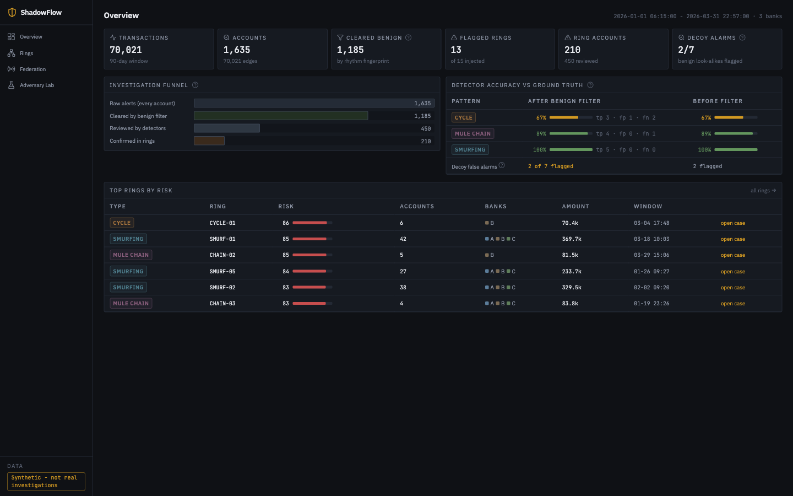
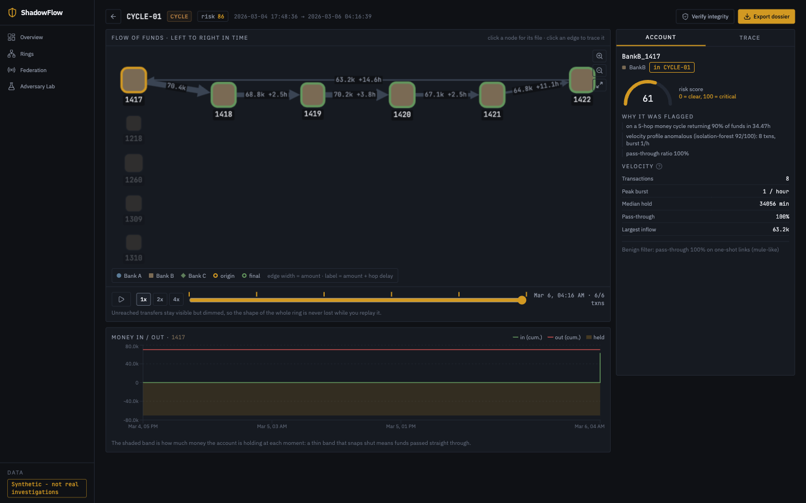
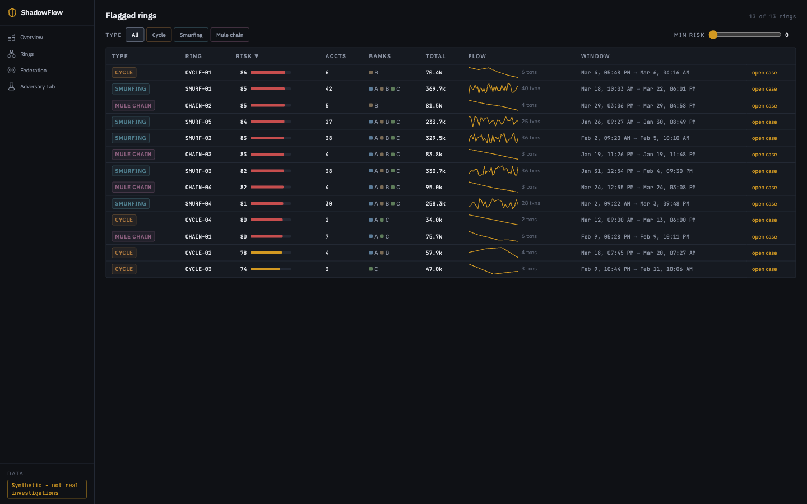
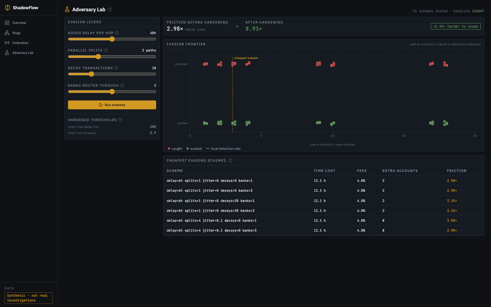

# ShadowFlow

ShadowFlow finds coordinated money-laundering networks in bank transaction logs. It generates a synthetic dataset of payments across three banks, looks for three laundering patterns, and shows the result as an investigation dashboard.

**Live demo:** https://shadowflow-zywt.vercel.app
**Backend API:** https://shadowflow-api.onrender.com (health check: https://shadowflow-api.onrender.com/health)

Everything in this repo runs on generated data. It is a demonstration of the method, not a tool for real investigations.

## The problem

Banks check accounts individually. A payment looks ordinary on its own. But when the same money is split, moved through several accounts, and sent back to where it started, the pattern is only visible if you look at the accounts together and at the same time. Manual review does not scale to 70,000 payments, and most single-account risk rules miss this because no single account looks bad.

## What it does

- **Generates a dataset.** A fixed seed (42) produces 70,021 payments between 1,635 accounts over 90 days across three synthetic banks, with known ground truth about which payments are criminal.
- **Clears normal accounts.** Every account gets a fingerprint of who it pays, how regular the payments are, and how much money passes through. Steady, varied, non-pass-through accounts are cleared as normal business. This drops 1,185 of 1,635 accounts.
- **Looks for three patterns.** Closed cycles that return money to the origin, chains that forward money quickly, and smurfing (many payments just under the reporting threshold landing on one account).
- **Scores what is left.** An Isolation Forest on transaction-timing features, combined with the pattern evidence, produces a 0-100 risk score per account plus a written reason.
- **Shows the case.** A case page with the flow of funds, a replay slider to step through the transfers in time order, and a forward trace that follows dirty money as it mixes with clean money.
- **Attacks its own detector.** A "laundering agent" searches for the cheapest way to move money past the detector, then the thresholds are tightened and the cost is measured again.
- **Shares across banks.** Each bank detects locally and shares only a salted hash, the pattern type, a rounded amount band and a time window. A coordinator stitches those into cross-bank cases.
- **Exports a case file.** A PDF dossier with a SHA-256 hash chain, so you can show a number was not edited afterwards.

## Screenshots

| Overview | Case file |
|---|---|
|  |  |

| Flagged rings | Adversary lab |
|---|---|
|  |  |

## Run it locally

Needs Python 3.11 and Node 18+.

```bash
make setup   # creates backend/.venv, installs Python and Node dependencies
make data    # generates the dataset and runs the detection pipeline
make run     # starts the backend on :8000 and the dashboard on :3000
```

Then open http://localhost:3000. The backend takes about 2 seconds to finish detection on first start. `make test` runs the 21 tests.

## Results

These are the numbers from the seed-42 run, measured against the ground truth the generator injects. They are reproducible: `make data` regenerates the same dataset every time.

**All results below are on synthetic data.** The generator creates the patterns and the detector was written for those same three pattern families, so these numbers describe this pipeline working as designed. They are not an accuracy claim about real transaction data.

| Measurement | Result |
|---|---|
| Dataset | 70,021 payments, 1,635 accounts, 3 banks, 90 days |
| Accounts cleared as normal business | 1,185 of 1,635 |
| Accounts sent to the detectors | 450 |
| Injected rings found | 13 of 15 |
| Cycle precision / recall / F1 | 0.75 / 0.60 / 0.67 |
| Mule chain precision / recall / F1 | 1.00 / 0.80 / 0.89 |
| Smurfing precision / recall / F1 | 1.00 / 1.00 / 1.00 |
| Benign look-alikes wrongly flagged | 2 of 7 |
| Detection runtime | about 1.4 seconds |
| Federation | 350 hashed signals, 4 cross-bank cases |
| Evasion cost before hardening | 2.98x the naive transfer |
| Evasion cost after hardening | 8.93x |

Two things worth being honest about in that table. The smurfing detector scores a perfect 1.00 because smurfing has a very clear signature once the benign filter has removed normal business. And two of the seven look-alike accounts are still flagged: those two repeat payments on a seasonal loop, which is genuinely the same shape as a laundering cycle, so we could not separate them without real ground truth. The two missing rings are also mostly detectors being strict, not the data being broken.

The cheapest way to beat the detector was to move the money in one hop after a 6 hour wait, with no splits, no decoys and one bank. After tightening the thresholds that rose to 8.93x the cost of a normal transfer.

## Project layout

```
shadowflow/
├── backend/                  FastAPI service (Python)
│   ├── main.py               API endpoints, CORS, startup detection
│   ├── generate_data.py      builds the synthetic dataset (seed 42)
│   ├── data/                 the generated CSVs and ground truth (committed)
│   ├── engine/
│   │   ├── graph.py          loads payments into a directed graph
│   │   ├── benign_filter.py  the normal-business fingerprint
│   │   ├── patterns.py       cycles, mule chains, smurfing
│   │   ├── scoring.py        risk scores and written reasons
│   │   ├── pipeline.py       runs the whole thing once at startup
│   │   ├── taint.py          follows dirty money forward
│   │   ├── adversary.py      searches for cheap evasions
│   │   ├── federation.py     hashed sharing and cross-bank stitching
│   │   └── dossier.py        PDF case file and hash chain
│   ├── tests/                21 tests
│   ├── Dockerfile            container build for Render
│   └── requirements.txt      pinned Python dependencies
├── frontend/                 Next.js dashboard (TypeScript)
│   ├── app/                  the five pages
│   ├── components/           flow-of-funds graph, step chart, retry gate
│   ├── lib/api.ts            all API calls in one place
│   └── src/                  colours and shared UI pieces
├── docs/                     screenshots
├── render.yaml               deployment config for the backend
└── scripts/                  demo script and Windows helpers
```

## Limitations

- **The data is synthetic and the detector knows the shapes.** Patterns are injected by the generator and the detectors were built for those three families. On real data these F1 scores would drop, and the hand-set thresholds in `engine/config.py` would need to be tuned against real cases.
- **Cross-bank sharing is simulated.** The three banks run in one process, the hash salt is a shared secret in the environment, and revealing an account is a mock authorisation step rather than a real access control. Salted hashes over a small id space are also not a strong privacy guarantee.
- **Two injected rings are missed** and two benign accounts are still flagged. Both are visible in the numbers above.
- **Nothing is stored.** Detection runs at startup and stays in memory. There is no database, no login and no record of past cases.
- **The adversary is a threshold search, not a real attacker.** It only tries the levers we implemented.
- **Detection assumes transaction data is complete.** It works on the log it is given; it cannot see accounts a bank never reports.

## Next steps

- Tune the thresholds against labelled real cases instead of the generator's ground truth.
- Replace the in-process federation with separate bank services and real key management.
- Add persistence so cases and analyst notes survive a restart.
- Extend the adversary with adaptive strategies that respond to what the detector is measuring.
- Add more pattern families (trade-based layering, rapid movement through newly opened accounts).

## Team

Built by: ABI J ,BHARATHY A R ,SIVA PADMESH C B

## License

MIT. See [LICENSE](LICENSE).